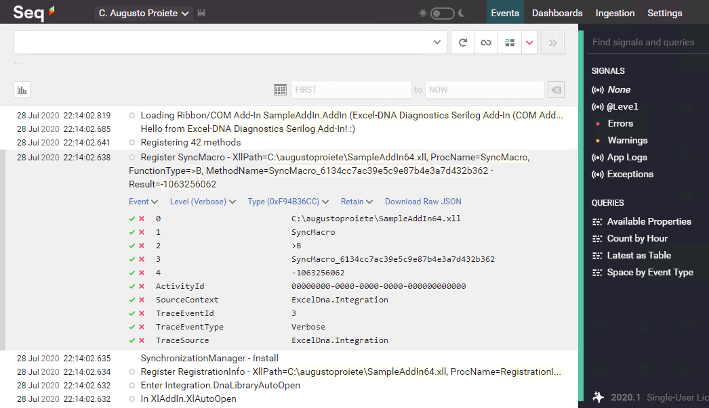

| README.md |
|:---|

<div align="center">


</div>

<h1 align="center">ExcelDna.Diagnostics.Serilog</h1>
<div align="center">

Integrate [Excel-DNA Diagnostic Logging](https://github.com/Excel-DNA/ExcelDna/wiki/Diagnostic-Logging) with your [Serilog](https://serilog.net) logging pipeling within your Excel-DNA add-in.

[](https://www.nuget.org/packages/ExcelDna.Diagnostics.Serilog/) [](http://stackoverflow.com/questions/tagged/excel-dna) [](http://stackoverflow.com/questions/tagged/serilog)



</div>

## Give a Star! :star:

If you like or are using this project please give it a star. Thanks!

## Background

Excel-DNA writes [diagnostic log messages](https://github.com/Excel-DNA/ExcelDna/wiki/Diagnostic-Logging) which can be very useful for troubleshooting issues with an add-in that is not working or behaving as expected. By default, messages are written to the [`LogDisplay`](https://github.com/serilog-contrib/serilog-sinks-exceldnalogdisplay) window, which can only be seen by the end-user of the add-in.


However, it's possible to configure Excel-DNA to write to _other_ `Trace` listeners which can then forward these diagnostic messages to any logging pipeline such as [Serilog](https://serilog.net), for example, in order to consume / analyse these logs outside of the user's machine.

[`ExcelDna.Diagnostics.Serilog`](https://github.com/augustoproiete/exceldna-diagnostics-serilog) implements a `TraceListener` that converts `Trace` log events to Serilog log events and integrates with a Serilog logging pipeline, effectivelly forwarding any diagnostic messages written by Excel-DNA to a Serilog logger.


## Getting started :rocket:

Install the [ExcelDna.Diagnostics.Serilog](https://www.nuget.org/packages/ExcelDna.Diagnostics.Serilog/) package from NuGet:

```powershell
Install-Package ExcelDna.Diagnostics.Serilog
```

If you don't have Serilog in your project yet, you'll need to [install one or more Serilog Sinks](https://github.com/serilog/serilog/wiki/Provided-Sinks) to have Excel-DNA diagnostic messages written to the destination you want. For example, if you'd like to write the messages to a file, you could use the [`Serilog.Sinks.File`](https://github.com/serilog/serilog-sinks-file) sink.

```powershell
Install-Package Serilog.Sinks.File
```

Sinks can be found in the list of [Provided Sinks](https://github.com/serilog/serilog/wiki/Provided-Sinks) in the Serilog documentation, and also by searching within the [`serilog` tag on NuGet.org](https://www.nuget.org/packages?q=Tags%3A%22serilog%22).

Configure Excel-DNA diagnostic logging and the Serilog Trace Listener in your `App.config` file:

```xml
<?xml version="1.0" encoding="utf-8" ?>
<configuration>
  <system.diagnostics>
    <sources>
      <source name="ExcelDna.Integration" switchValue="All">
        <listeners>
          <!-- (optional) Remove the `DefaultTraceListener`, which writes to the attached debugger -->
          <remove name="Default" />

          <!-- Remove any existing listener named `LogDisplay` (just in case) -->
          <remove name="LogDisplay" />

          <!-- Turn off the default `LogDisplayTraceListener` (we can use Serilog for that) -->
          <add name="LogDisplay"
               type="ExcelDna.Logging.LogDisplayTraceListener, ExcelDna.Integration">
            <filter type="System.Diagnostics.EventTypeFilter" initializeData="Off" />
          </add>

          <!-- Remove any existing listener named `ExcelDnaSerilog` (just in case) -->
          <remove name="ExcelDnaSerilog" />

          <!-- Add the listener that will forward Excel-DNA diagnostic messages to Serilog -->
          <add name="ExcelDnaSerilog"
               type="ExcelDna.Diagnostics.Serilog.SerilogTraceListener, ExcelDna.Diagnostics.Serilog" />
        </listeners>
      </source>
    </sources>
  </system.diagnostics>
</configuration>
```

[Configure your Serilog logging pipeline](https://github.com/serilog/serilog/wiki/Configuration-Basics), create your root logger, and call `ExcelDnaTraceSource.WriteToSerilog()` to start forwarding any diagnostic messages written by Excel-DNA to your Serilog logger.

```csharp
public class AddIn : IExcelAddIn
{
    public void AutoOpen()
    {
        Log.Logger = new LoggerConfiguration()
            .MinimumLevel.Verbose()
            .WriteTo.File($"{ExcelDnaUtil.XllPath}.log")
            .WriteTo.Seq("https://central-logging-system.company.net")
            .CreateLogger();

        // Forward any messages written by Excel-DNA to Serilog
        ExcelDnaTraceSource.WriteToSerilog();
    }

    // ...
}
```


## Example of an Excel-DNA add-in using `ExcelDna.Diagnostics.Serilog`

In the [sample](sample/) folder, you can find an example of an Excel-DNA add-in that captures any diagnostic messages written by Excel-DNA and forwards them to a Serilog logging pipeline configured to write log events to a file on disk and also to Excel-DNA's built-in [`LogDisplay`](https://github.com/serilog-contrib/serilog-sinks-exceldnalogdisplay).


## Mapping of Trace events to Serilog

`Trace` events are mapped to Serilog log events in the following way:

| Trace TraceEventType         | :arrow_right: | Serilog LogEventLevel       |
| ---------------------------- | ------------- | --------------------------- |
| `TraceEventType.Critical`    | :arrow_right: | `LogEventLevel.Fatal`       |
| `TraceEventType.Error`       | :arrow_right: | `LogEventLevel.Error`       |
| `TraceEventType.Warning`     | :arrow_right: | `LogEventLevel.Warning`     |
| `TraceEventType.Information` | :arrow_right: | `LogEventLevel.Information` |
| `TraceEventType.Start`       | :arrow_right: | `LogEventLevel.Debug`       |
| `TraceEventType.Stop`        | :arrow_right: | `LogEventLevel.Debug`       |
| `TraceEventType.Suspend`     | :arrow_right: | `LogEventLevel.Debug`       |
| `TraceEventType.Resume`      | :arrow_right: | `LogEventLevel.Debug`       |
| `TraceEventType.Transfer`    | :arrow_right: | `LogEventLevel.Debug`       |
| `TraceEventType.Verbose`     | :arrow_right: | `LogEventLevel.Verbose`     |

### Log Event Properties

Diagnostic log messages forwarded to Serilog have the [`SourceContext`](https://github.com/serilog/serilog/wiki/Writing-Log-Events#source-contexts) property set to `ExcelDna.Integration`, allowing developers to use [filters](https://github.com/serilog/serilog/wiki/Configuration-Basics#filters), [sub-loggers](https://github.com/serilog/serilog/wiki/Configuration-Basics#sub-loggers), and [minimum level overrides](https://github.com/serilog/serilog/wiki/AppSettings#adding-minimum-level-overrides).

`Trace` event fields (when available) are added as [custom properties](https://github.com/serilog/serilog/wiki/Enrichment) to Serilog log events with the following names:
  * `ActivityId` - A structure that identifies the related activity
  * `Category` - A category name used to organize the output
  * `TraceEventId` - A numeric identifier for the event
  * `FailDetails` - A detailed error message to emit
  * `RelatedActivityId` - A structure that identifies the related activity
  * `TraceSource` - A name used to identify the output, typically the name of the application that generated the trace event
  * `TraceData` - The trace data to emit
  * `TraceEventType` - One of the `System.Diagnostics.TraceEventType` values specifying the type of event that has caused the trace


## Excel-DNA configuration for packing with `ExcelDnaPack`

In order for the Excel-DNA Diagnostics Serilog to work from an add-in that is packaged using the `ExcelDnaPack` utility, you need to include references to `Serilog.dll` and `ExcelDna.Diagnostics.Serilog.dll` in the `.dna` file of the add-in along with references to the assemblies of any other sinks you may have added:

```xml
<DnaLibrary Name="My Add-In" RuntimeVersion="v4.0">
  <ExternalLibrary Path="MyAddIn.dll" ExplicitExports="false" LoadFromBytes="true" Pack="true" />

  <Reference Path="Serilog.dll" Pack="true" />
  <Reference Path="Serilog.Sinks.SomeSink.dll" Pack="true" />
  <Reference Path="ExcelDna.Diagnostics.Serilog.dll" Pack="true" />
  <!-- etc. -->
```

## Release History

Click on the [Releases](https://github.com/augustoproiete/exceldna-diagnostics-serilog/releases) tab on GitHub.

---

_Copyright &copy; 2019-2023 C. Augusto Proiete & Contributors - Provided under the [Apache License, Version 2.0](LICENSE)._
